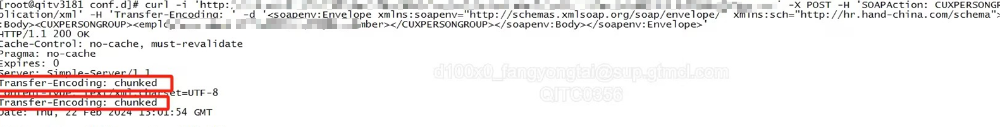
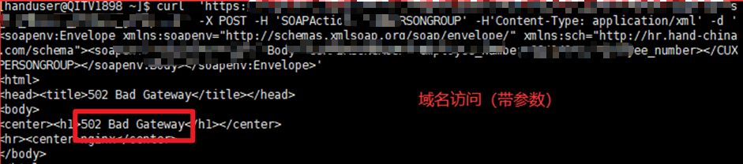

# 问题描述

应用侧返回重复的 Transfer-Encoding 导致接入 Nginx 后请求 502。

客户将Nginx从1.20.2升级到1.24.0，导致Nginx代理的应用全部报错502

直接访问应用测试正常返回，但有两个重复的响应头 Transfer-Encoding 



而使用Nginx代理应用后，调用报错：


查看日志：

```Shell
2024/02/23 13:34:56 [error] 40676#24372: *21 upstream sent duplicate header line: "Transfer-Encoding: chunked", previous value: "Transfer-Encoding: chunked" while reading response header from upstream, client: 127.0.0.1, server: localhost, request: "POST /api/v2/hello HTTP/1.1", upstream: "http://127.0.0.1:8080/v2/hello", host: "localhost"
```


根据日志可以轻松知道，重复的响应头会导致转发失败。


# 分析

Nginx升级新增了对重复响应头 Transfer-Encoding 的校验逻辑，需要将响应头去重


# 处理

因无应用程序源码，故无法查证产生重复响应头的原因，考虑在servlet增加全局过滤器过滤，禁止引用程序设置  Transfer-Encoding


# 源码地址
https://github.com/a743110094/aurora-duplicate-header-fliter.git